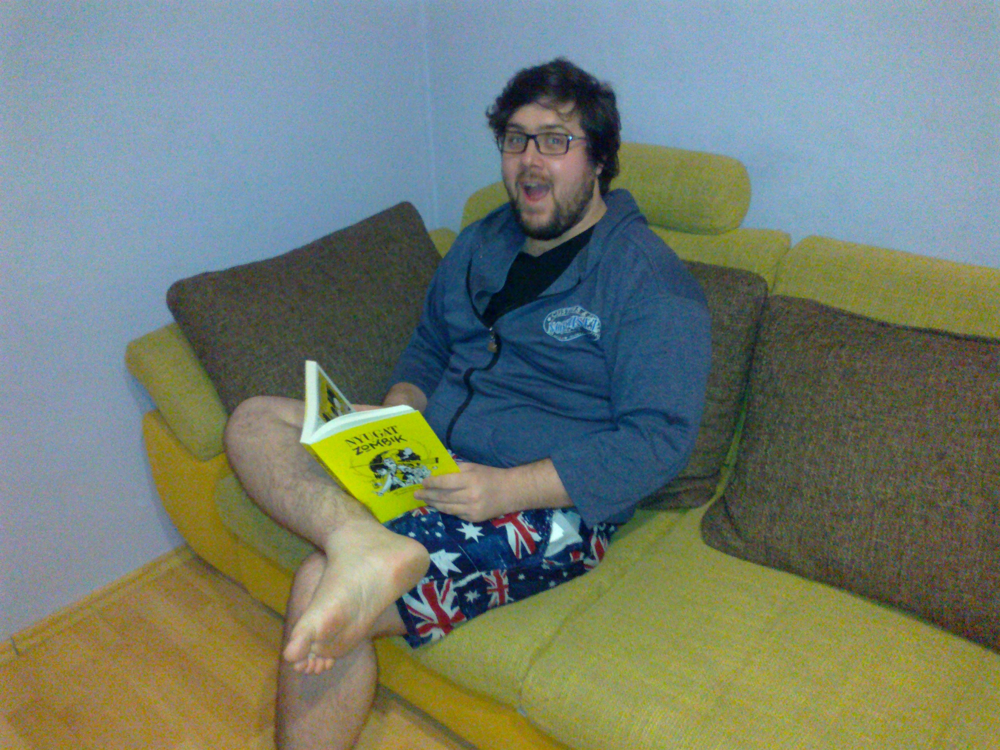
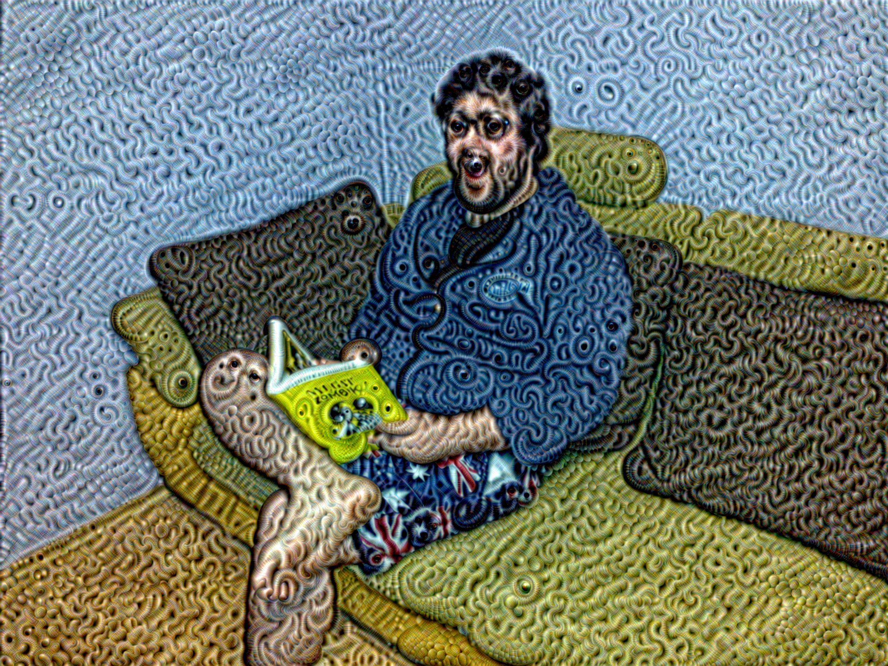

# DeepDream playground

## Important notes

Most of the code in this repository has been copied from this [TensorFlow Tutorial](https://github.com/Hvass-Labs/TensorFlow-Tutorials). I was going through [this guide](https://github.com/Hvass-Labs/TensorFlow-Tutorials/blob/master/14_DeepDream.ipynb) and I copied [inception5h.py](https://github.com/Hvass-Labs/TensorFlow-Tutorials/blob/master/inception5h.py) while slightly modifying them to be able to run it in [PyCharm](https://www.jetbrains.com/pycharm/) with Python 3.8.6 and TensorFlow 2.3.1.

## Usage

If you want to try it out with your own images, you can do that either by replacing my image or by adding your own and modifying the filename parameter in line 174.

## How does it look  

Before:

After:

